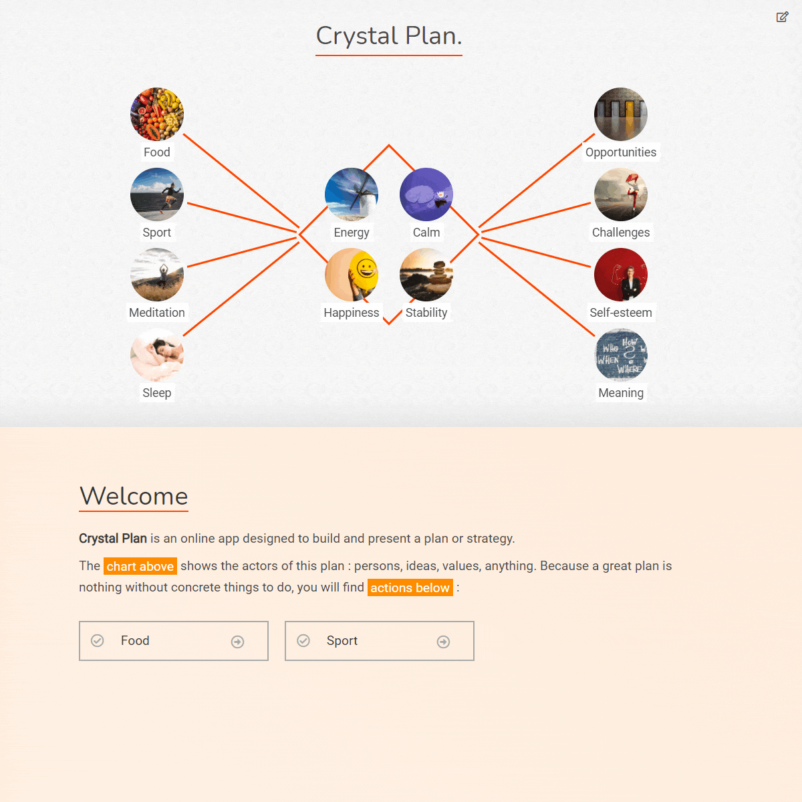

# Crystal Plan

[](https://github.com/Shuunen/crystal-plan/blob/master/LICENSE)

[](https://crystal-plan.netlify.app)
[](https://lgtm.com/projects/g/Shuunen/crystal-plan)

> Create & present your plan, the crystal clear way.



[Try online](https://crystal-plan.netlify.com/)

## Usage

``` bash
npm install
npm start # local development
npm run build # build for production
```

## Thanks

- [Eslint](https://eslint.org) : super tool to find & fix problems
- [Github](https://github.com) : for all their great work year after year, pushing OSS forward
- [Netlify](https://netlify.com) : awesome company that offers hosting for OSS
- [Npm-run-all](https://github.com/mysticatea/npm-run-all): to keep my npm scripts clean & readable
- [Repo-checker](https://github.com/Shuunen/repo-checker) : eslint cover /src code and this tool the rest ^^
- [Shields.io](https://shields.io) : nice badges on top of this readme
- [Travis-ci.com](https://travis-ci.com) : for providing free continuous deployments
- [Vue](https://vuejs.org) : when I need a front framework, this is the one I choose <3
